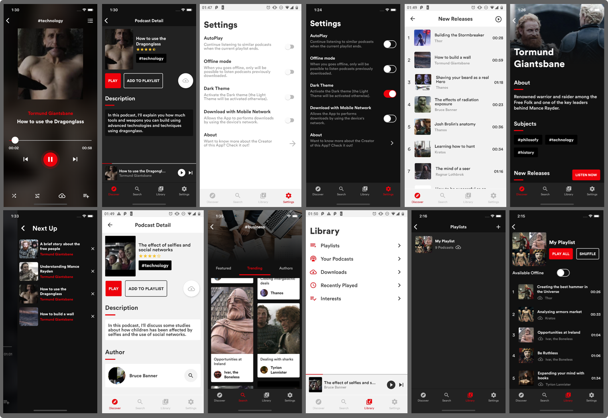

# MindCast react-native app

## Functionalities

- Choose your interests (all, technology, philosfy, science, business, pop-culture or history - it will be used to make requests in order to have a personalized app with what the user want to hear about)

- Get informations about a specific Author, with his New Releases/Featured Podcats and Related Authors

- Get Informations about a specific Podcast, with its description and Author

- Listen and download a single podcasts to listen offline (no need to create a playlist)

- Playlists
	- Create, Edit and Remove your Playlists
	- Download Playlists to listen when the user goes offline
	- Undownload Playlists

- Player to listen the selected podcasts and also be able to: 
	- Shuffle Playlist
	- Repeat Playist
	- Repeat a single Podcast
	- Donwload the current podcast
	- Add the current Podcast to a Playlist
	- Access the queue of next podcasts that will be played
	- Remove podcasts from the queue
	- Play/Pause the current Podcast
	- Next/Previous podcast on the Playlsit

- Bottom Player
	- Access the bottom player out of the Player screen in order to keep tracking the current podcast
	- Get the Author and the Title of the current podcast
	- Play/Pause/Forward the current podcast
	- Track the timer of the current podcast

- Discover
	- A Dashboard with:
	  - Trending Authors
	  - Hottest Podcasts
	  - New Podcasts Released

- Search

	- Search for Authors by name

	- Get information about a certain category, showing it's featured and trending podcats, and the authors that talk about this category

- Library
	- Create Playlists, add podcasts and download it to listen offline

	- Access Your Podcasts (Downloaded + Podcasts saved on your Playlists) in the form of playlist

	- Access your Podcasts downloaded in the form of playlist
	
	- Access recently played podcasts in the form of playlist

	- Change your interests

- Settings

	- Choose between the Dark and Light theme

## Built With

- [React-Native](https://facebook.github.io/react-native/) - Build the native app using JavaScript and React
- [React-Navigation](https://reactnavigation.org/docs/en/getting-started.html) - Router
- [Redux](https://redux.js.org/) - React State Manager
- [Redux-Saga](https://redux-saga.js.org/) - Side-Effect middleware for Redux
- [Axios](https://github.com/axios/axios) - HTTP Client
- [ESlint](https://eslint.org/) - Linter
- [React-Native-Dotenv](https://github.com/zetachang/react-native-dotenv) - Configs from .env file
- [Flow](https://redux-saga.js.org/) - Static Type Checker
- [Prettier](https://prettier.io/) - Code Formatter
- [Babel](https://babeljs.io/) - JavaScript Compiler
- [Reactotron](https://infinite.red/reactotron) - Inspector
- [Styled-Components](https://www.styled-components.com/) - Styles
- [React-Native-Fast-Image](https://github.com/DylanVann/react-native-fast-image) - Image Loader
- [React-Native-Linear-Gradient](https://github.com/react-native-community/react-native-linear-gradient) - Gradient Styles
- [React-Native-SplashScreen](https://github.com/crazycodeboy/react-native-splash-screen) - Splashscreen of the App
- [React-Native-Vector-Icons](https://github.com/oblador/react-native-vector-icons) - Icons
- [React-Native-Side-Menu](https://github.com/react-native-community/react-native-side-menu) - Side Menu used on Player screen
- [React-Native-Swipeout](https://github.com/dancormier/react-native-swipeout) - Swipe for edit/remove playlists and remove podcasts inside some playlist
- [React-Native-Video](https://github.com/react-native-community/react-native-video) - Consume the audio files via streaming
- [React-Native-FS](https://github.com/itinance/react-native-fs) - Handle download/undownload podcasts on file-system

## Support tools

- [Image-Resize](https://imageresize.org) - Resize the Images
- [Amazon S3](https://aws.amazon.com/pt/s3/) - Storage Service

## Contributing

You can send how many PR's do you want, I'll be glad to analyse and accept them! And if you have any question about the project...

Thank you!
